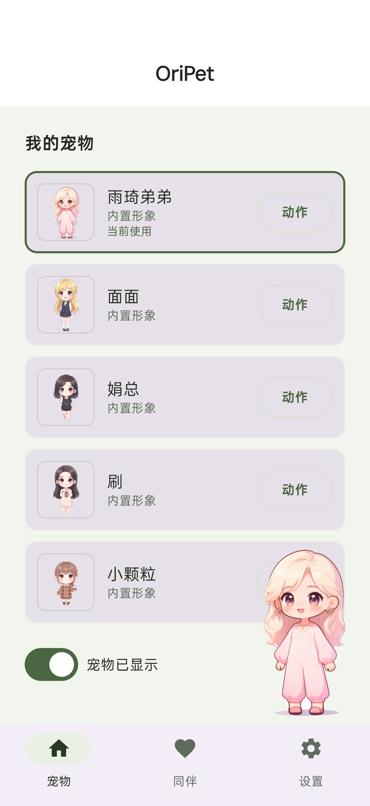
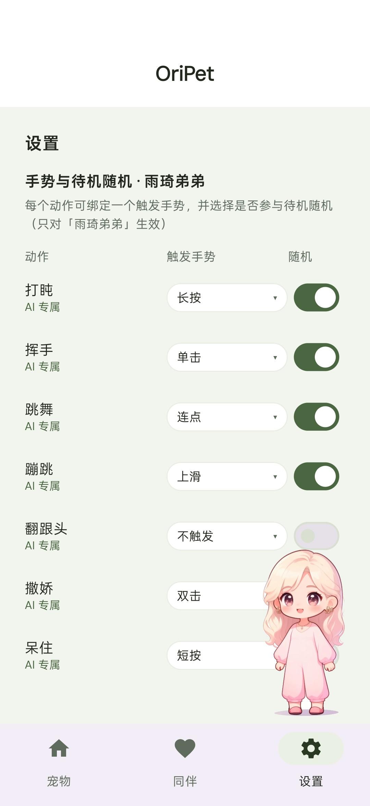
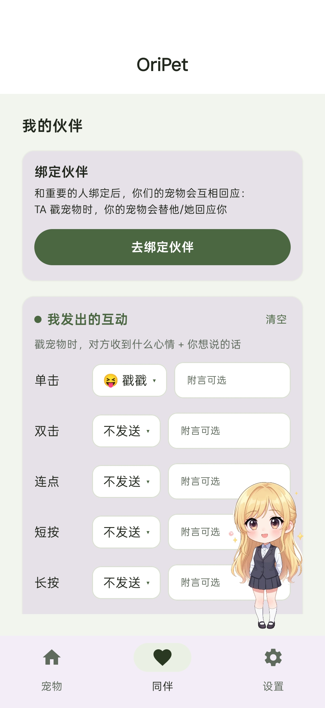

# 🐾 OriPet 桌面宠物

把喜欢的 Q 版宠物放到手机桌面 —— 常驻陪伴、触摸互动、可爱动作。

**Android 安装包下载仓库**

## 使用说明

1. 下载下方 APK（约 15 MB，支持 Android 8.0+）
2. 安装（首次需允许"安装未知来源应用"）
3. 打开 App → 按提示授予**悬浮窗权限**（系统设置 → 应用 → OriPet → 显示在其他应用上层）→ 返回 App 即可召唤宠物

## 下载

📦 [`dist/oripet-public-demo-v1.0.0.apk`](dist/oripet-public-demo-v1.0.0.apk)

> 体验包包含全部内置 Q 版宠物与互动功能：触摸反馈、专属动作、桌面常驻。
> 纯净无广告、无账号、无内购、无网络权限。

## 界面预览

| 形象馆 | 动作设置 | 伙伴互动 |
|---|---|---|
|  |  |  |

### 操作演示

<video src="docs/demo.mp4" controls="controls" muted="muted" style="max-height:560px;border-radius:8px;"></video>

> 若上方无法播放，可点击 ▶️ [打开视频文件](docs/demo.mp4)（GitHub 文件页支持直接播放）

## 常见问题

- **宠物不显示？** 检查"显示在其他应用上层"权限是否开启，并回到 App 点击召唤。
- **能卸载吗？** 直接卸载即可，不留后台残留。
- **源码公开吗？** 本仓库仅用于安装包分发，源码不在此公开。

---
© 2026 OriPet
